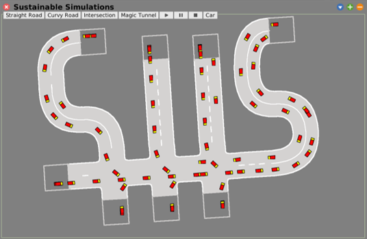

<p align="center">
    
</p>

<h1 align="center">Sustainable Simulations</h1>

<p align="center">
    <a href="https://github.com/hpi-swa-teaching/TelegramClient/commits/" title="Last Commit"></a>
    <a href="https://github.com/hpi-swa-teaching/TelegramClient/issues" title="Open Issues"></a>
    <a href="./LICENSE" title="License"></a>
</p>

## Overview

Sustainable Simulations is a Squeak Application to build and simulate complex traffic networks. It is easy to use, accurate and highly scalable.

## Features

| ✨  | Feature |
| --- | --------| 
| 🔧 | Building complex road networks made easy: Just point and click to build new roads, or click two road ends to connect them automatically. |
| 🛣️ | Different Road types: From Basics like straight roads or curves, over car spawning tunnels to cross- or t-intersections, this simulation got them all! |
| 🚗 | Angry about all those irresponsible drivers out there? Not on our watch! We have got intelligent cars which drive cautiously and even accelerate and deaccelerate responsibly. |
| ⏯️ | Need the simulation to stop for a second so you can continue building? No problem! We support pausing, playing and even resetting the simulation to its original state. |
| 💡 | Built to be extended: Just add another vehicle, new road types, a different road skin or even intersection strategies. |
| ✅ | Made to last: With comprehensive tests we reduce the risk of future defects and validate our application with every release. |

## Installation

1. Download the latest .sar from the release page.
2. Drag the sar-File into your squeak image.
3. Click "Install SAR"

## Running Sustainable Simulations

Pick your favourite text field and run
```smalltalk
SUSWindow new openInWorld
```
